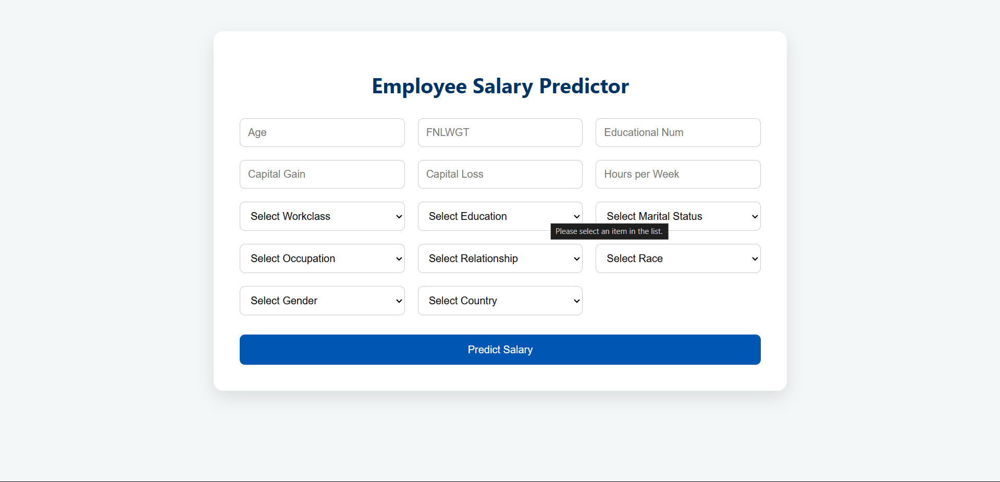
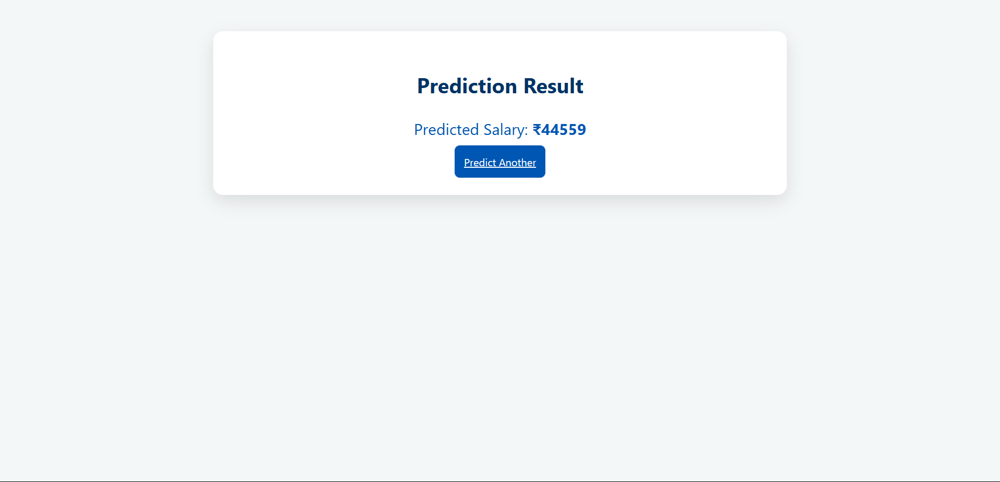

# Employee Salary Prediction

This project predicts employee salaries using machine learning techniques on census data. It includes data preprocessing, model training, and a web interface for making predictions.

## Project Structure

```
.
├── adult 3.csv
├── app.py
├── explore_dataset.py
├── preprocess_and_split.py
├── salary_regressor_model.pkl
├── train_model.py
├── X_test.csv
├── X_train.csv
├── y_test.csv
├── y_train.csv
├── static/
│   └── style.css
└── templates/
    ├── index.html
    └── result.html
```

## Setup Instructions

1. **Clone the repository**  
   ```
   git clone <repository-url>
   cd Employee_Salary_Prediction
   ```

2. **Install dependencies**  
   ```
   pip install -r requirements.txt
   ```
   *(Create a `requirements.txt` with packages like `pandas`, `scikit-learn`, `xgboost`, `flask`, etc.)*

3. **Preprocess the data**  
   ```
   python preprocess_and_split.py
   ```

4. **Train the model**  
   ```
   python train_model.py
   ```

5. **Run the web app**  
   ```
   python app.py
   ```
   The app will be available at `http://127.0.0.1:5000/`.

## Files

- [`preprocess_and_split.py`](preprocess_and_split.py): Cleans and encodes the data, splits into train/test sets.
- [`train_model.py`](train_model.py): Trains an XGBoost regressor and saves the model.
- [`app.py`](app.py): Flask web app for user input and salary prediction.
- [`templates/index.html`](templates/index.html): Web form for input.
- [`templates/result.html`](templates/result.html): Displays prediction result.
- [`static/style.css`](static/style.css): Styles for the web app.

## Usage

1. Open the web app.
2. Enter employee details in the form.
3. Submit to get the predicted salary.

...existing code...

## Screenshots

**Input Page:**  



**Output Page:**  



## License

This project is for educational purposes.
